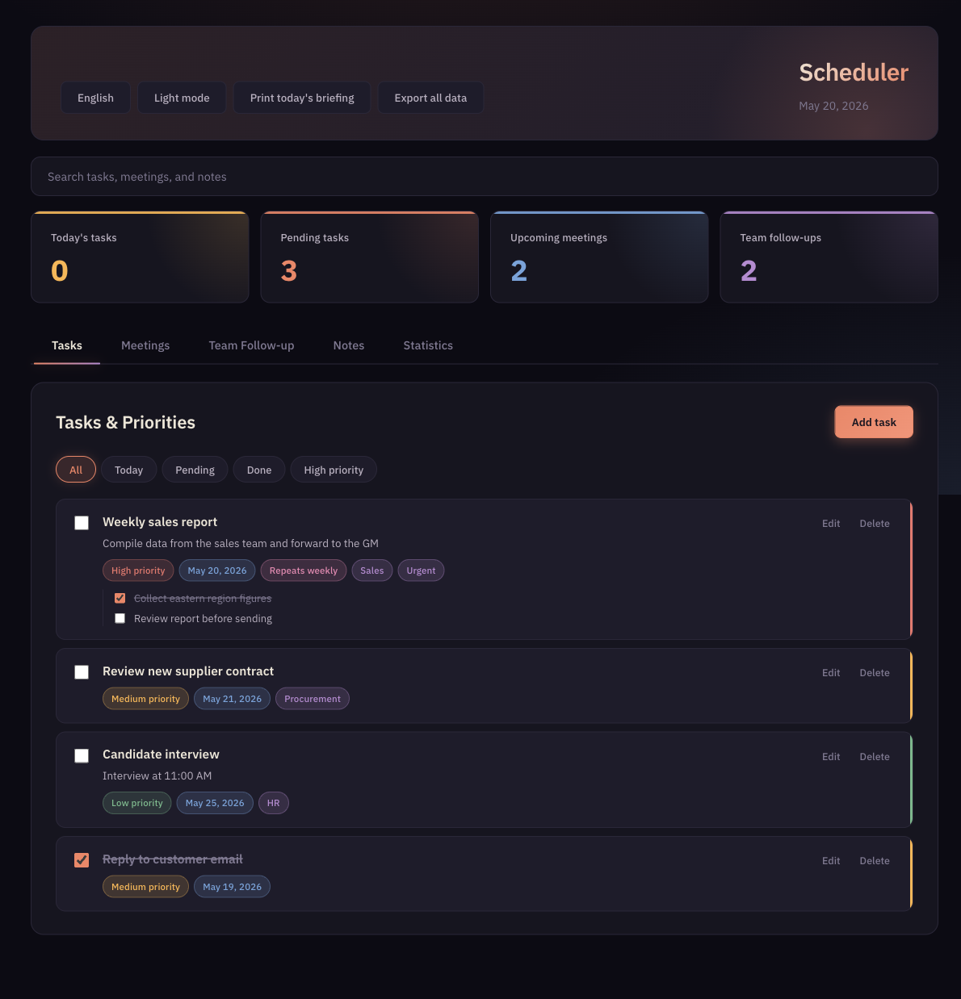
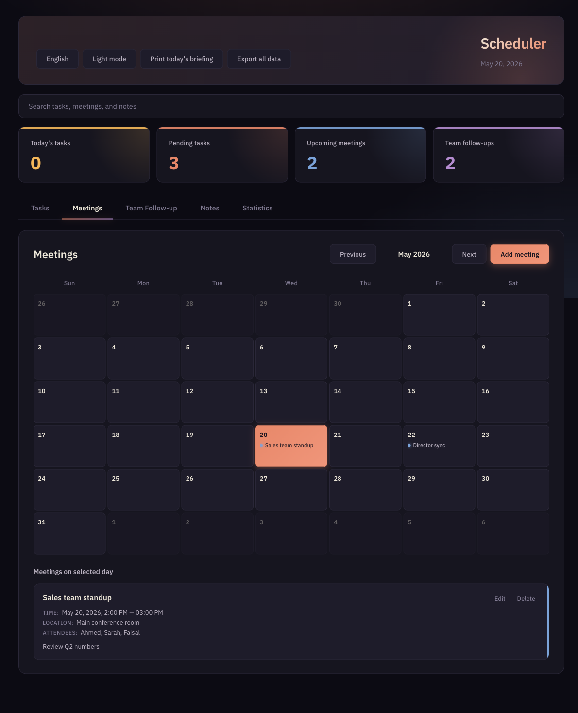
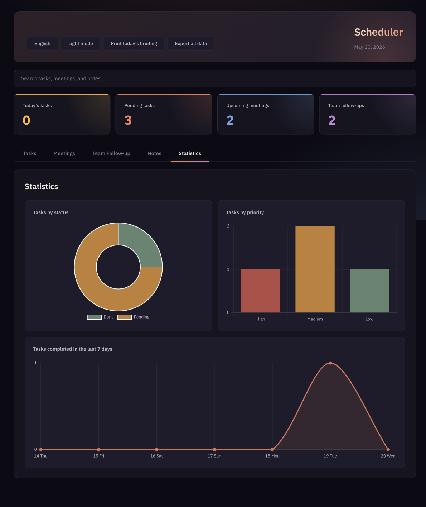
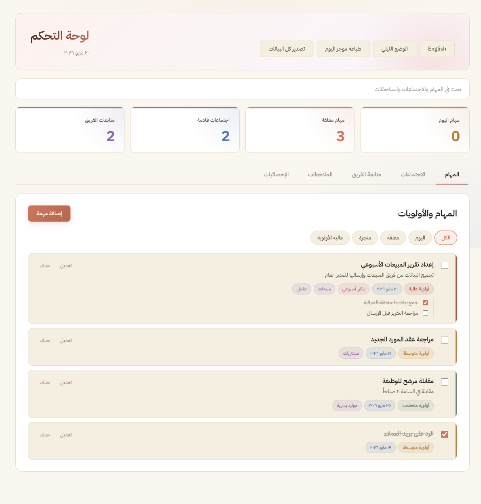

<div align="center">


# Scheduler

**A focused productivity dashboard for managers — tasks, meetings, team follow-ups, and notes in one local-first desktop app.**

[](https://github.com/krispx2811/scheduler/releases/latest)
[](#download)
[](https://www.electronjs.org/)
[](#license)
[](#auto-updates)

<br />



</div>

---

## What it does

Scheduler is an offline-first desktop app that gives a manager a single place to plan their day. Everything you enter is stored as a local JSON file on your machine — no servers, no accounts, no cloud sync, no telemetry. The app silently checks GitHub for new releases on launch and updates itself in the background.

Built with **Electron + vanilla JS**. No frameworks, no build step for the UI, no telemetry, no analytics — just HTML, CSS, and a few hundred lines of JavaScript.

## Features

- **Tasks** — title, description, priority (high / medium / low), due dates, tags, subtask checklists, recurring tasks (daily / weekly / monthly), drag-and-drop reordering.
- **Meetings** — month calendar with click-to-filter, file attachments, attendees, location, notes.
- **Team follow-ups** — track open items per teammate with due dates and status.
- **Notes** — text notes and recorded voice notes (uses the system microphone).
- **Global search** — one search box hits tasks, meetings, follow-ups, and notes simultaneously.
- **Statistics** — three Chart.js charts: status breakdown, priority distribution, completed-in-last-7-days trend.
- **Desktop notifications** — fires when a task is due today or a meeting is within 15 minutes.
- **Print-friendly daily briefing** — one-click print of today's tasks, meetings, and open follow-ups.
- **Export** — JSON (full backup including attachments and audio) or CSV/Excel (UTF-8 with BOM, opens cleanly in Excel).
- **Bilingual** — full Arabic (RTL) and English (LTR) modes, swap with one click.
- **Light + dark theme** — both Claude-inspired palettes; remembered across restarts.
- **Auto-updates** — checks GitHub Releases on launch and every 4 hours; downloads in the background; prompts to restart when ready.

## Screenshots

<details open>
<summary><strong>Dark mode — English</strong></summary>

| Tasks | Meetings | Statistics |
|---|---|---|
|  |  |  |

</details>

<details>
<summary><strong>Light mode — Arabic (RTL)</strong></summary>



</details>

## Download

Grab the latest installer for Windows from the [Releases page](https://github.com/krispx2811/scheduler/releases/latest):

| File | Size | What you get |
|---|---|---|
| **`Scheduler-x.y.z-Setup.exe`** | ~79 MB | Recommended — proper installer; installs to `%LocalAppData%\Programs\Scheduler`, adds Desktop + Start Menu shortcuts, registers for auto-update, no admin prompt. |
| `Scheduler-x.y.z-portable.exe` | ~79 MB | Standalone .exe, no install needed. Heuristic-flagged by Defender; prefer the installer. |

> Windows Defender may show a SmartScreen prompt the first time you run an unsigned app. Click **More info → Run anyway**. The .exe is unsigned because code-signing certificates cost $70–500/year. The full source is in this repo — you can audit and rebuild it yourself.

### Where data is stored

Your data lives in `%APPDATA%\Scheduler\scheduler-data.json` (or your platform's user-data folder). Back it up by copying that file. Restore via the in-app **Export all data → JSON** + a manual replace.

## Auto-updates

Every installed copy:

1. Checks `https://github.com/krispx2811/scheduler/releases/latest` on launch and every 4 hours.
2. Downloads the new installer in the background when a version is available.
3. Shows a small banner — click **Restart & install** to apply.

No accounts, no servers — it just polls the GitHub Releases API for public repos.

## Tech

| Layer | What |
|---|---|
| Shell | Electron 33 (Chromium + Node 20) |
| UI | Vanilla JS + HTML + CSS — no React/Vue/build step |
| Storage | JSON file in `app.getPath('userData')` via Electron `ipcMain` |
| Charts | Chart.js 4 (bundled, offline) |
| i18n | Hand-rolled dictionary at [renderer/i18n.js](renderer/i18n.js), AR ↔ EN |
| Theme | CSS custom properties + `[data-theme="light"/"dark"]` |
| Updates | `electron-updater` + GitHub Releases provider |
| Packaging | `electron-builder` — NSIS installer + portable .exe |

## Project structure

```
├── main.js              Electron main process — IPC, storage, auto-updater
├── preload.js           Context-bridge between main and renderer
├── renderer/
│   ├── index.html       Single-page UI with [data-i18n] hooks
│   ├── styles.css       Theme system (dark + light), responsive layout
│   ├── app.js           All UI logic — tasks, meetings, search, charts, etc.
│   ├── i18n.js          Translation dictionary + t() helper
│   └── vendor/          Bundled Chart.js (copied from node_modules at install)
├── scripts/
│   ├── copy-vendor.js   postinstall — places chart.umd.js into renderer/vendor
│   └── make-icon.js     Generates the app icon at build/icon.png
├── build/
│   └── icon.png         512x512 brand icon (electron-builder converts to .ico/.icns)
└── package.json         Dependencies + electron-builder config + publish target
```

## Build from source

```bash
git clone https://github.com/krispx2811/scheduler.git
cd scheduler
npm install        # also generates renderer/vendor/chart.umd.js
npm start          # launches the Electron app for development on macOS/Linux

# Build the Windows installer + portable .exe (works on macOS/Linux/Windows)
npm run build:win
# Output → dist/Scheduler-x.y.z-Setup.exe, dist/Scheduler-x.y.z-portable.exe
```

> On macOS, `electron-builder` cross-builds Windows targets by downloading the Windows Electron binary; no Windows machine needed.

## Publishing a new release (for the maintainer)

1. Bump the version in `package.json` (`1.0.0 → 1.0.1`).
2. Commit and push: `git commit -am "v1.0.1" && git push`.
3. Build + publish in one step:
   ```bash
   GH_TOKEN=$(gh auth token) npm run publish:win
   ```
   This builds the installer and uploads `Scheduler-1.0.1-Setup.exe`, the portable, the blockmap, and `latest.yml` to a new GitHub release.
4. Every installed copy auto-detects the new version within ~4 hours (or on next launch) and prompts the user to restart.

## Roadmap / not yet implemented

- macOS + Linux installer targets (only Windows is published today)
- Cloud sync between devices (currently local-only by design)
- Code-signing the .exe to remove the SmartScreen prompt — requires a paid certificate
- Markdown rendering in notes
- Calendar export to `.ics`

## License

Personal/private project. The source is public for transparency and so installed apps can verify update integrity; reuse is at your own discretion.

---

<div align="center">

Made with care. No telemetry, no tracking, no accounts.

</div>
